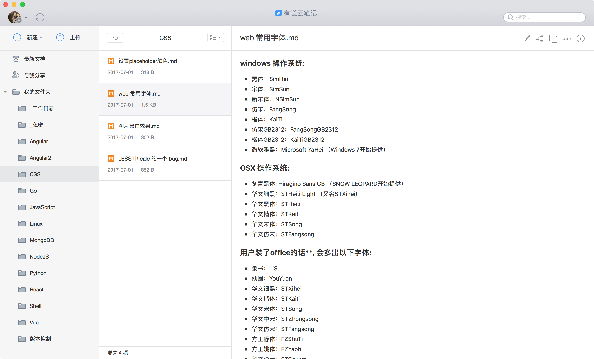
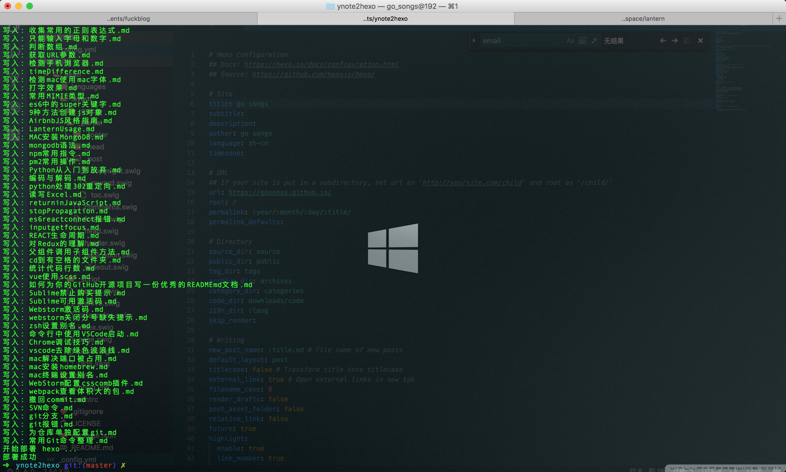
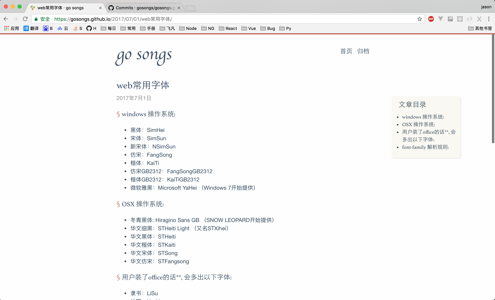

## 同步有道云笔记中的 markdown 笔记到 hexo 博客




## Install

```python
pip install requests

# 修改 start.py 中的 HEXO_DIR 为你的 Hexo 目录
# 请事先手动登录有道云笔记, 并拷贝 Cookie 中的这些值: YNOTE_PERS、YNOTE_SESS、YNOTE_LOGIN、YNOTE_CSTK
# 并替换 start.py 中对应的值
python start.py
``` 

## 操作流程
1. 模拟登陆, 获取访问其他接口的权限, 需要 `YNOTE_PERS`、`YNOTE_SESS`、`YNOTE_LOGIN`、`YNOTE_CSTK` 这四个存在 `Cookie` 里的值 ==这条没有实现, 需要手动登录==;
1. 读取笔记本, 忽略 `_` 开头的笔记本;
1. 读取笔记本里的笔记, 忽略 `_` 开头的笔记;
1. 读取笔记并存储为 `.md` 格式的文件到 `_posts` 中;
1. 替换 `_posts` 文件夹到 `hexo/source/_posts`;
1. 部署 Hexo;
1. 部署到服务器以后, 可以添加定时任务, 比如每天凌晨同步一次;

## 注意
+ 务必保证你的 Hexo 目录是可以正常部署的;
+ 频繁退出/登录, 会触发验证码, 代码不做处理;
+ 忽略富文本笔记, 只读取 markdown 格式的笔记;
+ `_` 开头的笔记本和笔记认为是私密的, 不会读取;
+ 笔记本不支持嵌套;
+ 由于 Hexo 标题限制, 将移除标题里的特殊字符和空格, 仅允许中文/英文/数字组合;
+ 由于 Hexo 内容限制, 笔记中不能出现类似于 `{{}}` 或者 `` 的片段, 这将导致 `hexo generate` 失败;

## TODO
+ [ ] 模拟登陆;
+ [x] 部署 Hexo;
+ [ ] 定时任务;
+ [ ] 代码太挫了, 有时间再改;

**欢迎 Fork 和 Start ! 🤓**